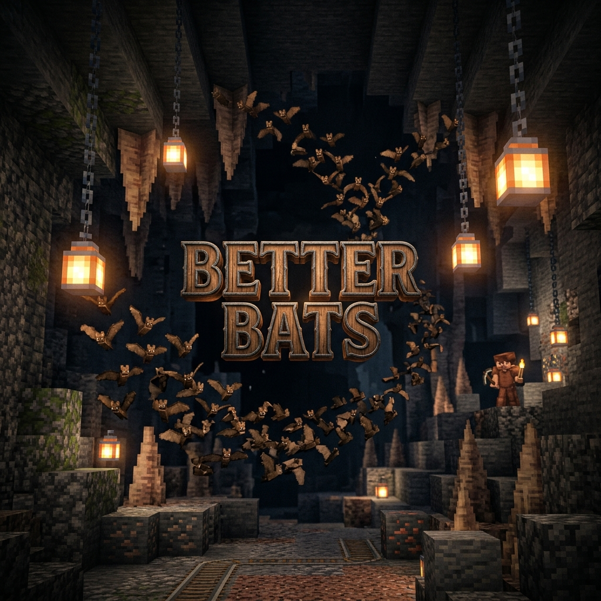

# 🦇 Better Bats

    
    
    

# 🦇 Better Bats: The "Acoustic & Sleep" Update (Build 4)

**Active Version Policy:** I build **1 JAR for 1 Version**. I only update and maintain the latest active Minecraft version (e.g. when 26.3 is released, 26.2 is retired). No backports or legacy version maintenance. Please do not ask.

**The Vanilla Problem**: In vanilla Minecraft, bats are purely cosmetic, chaotic, ambient entities that offer no interactive value to the player's world. They fly aimlessly, spawn in complete darkness, and drop absolutely nothing, rendering them essentially useless.

**Better Bats** changes this foundation. It integrates bats into the ecosystem as active, social, and symbiotic neighbors. They group into coordinated swarms, seek shelter from the sun, fertilize crops, hunt insect pests, circle lanterns, and panic dynamically when loud events disrupt their sleep.

---

## ✨ Features

### 🌪️ Hive Mind (Social Swarms)

Bats no longer fly in erratic, individual patterns. They organize into cohesive swarms using the **DasikLibrary** flocking strategy. Witness groups of bats moving together in coordination through cave corridors.

> [!NOTE]
> **Boids Steering**: Swarm flight is powered by a dynamic Boids murmuration algorithm.
> Flocking Range: **16 blocks** — Bats dynamically elect a leader and align their movement vectors.

### 💩 Guano Fertility (Natural Growth)

Forget wasting bone meal. While roosting upside down in the dark, bats slowly accumulate guano. Every 10 minutes, they drop guano to fertilize soil and crops far below.

> [!TIP]
> **Farmland Enrichment**: If a bat roosts above crops, it scans up to **20 blocks down** to apply a bone meal growth tick.

### 💡 Phototaxis (Lantern Hunting)

During the night, bats are attracted to bright artificial light sources. They break from their swarms to circle lanterns and torches, simulating the hunting of insects attracted to the glow.

> [!NOTE]
> **Insect Feeding**: Bats will circle light sources with a brightness level **>12**, emitting `crit` particles to represent feeding.

### 🛡️ Pest Control (Symbiotic Defense)

Bats are natural allies in pest management. They will aggressively dive-bomb and one-shot crawling pests that enter their vicinity.

> [!TIP]
> **Predatory Prey**: Bats target **Silverfish** and **Endermites** in a **10-block radius** and instantly defeat them.

### 📢 Acoustic Panic

Caves are quiet for a reason. Loud noises (sprinting players, block mining, explosions) nearby will wake sleeping bat swarms instantly, sending them into a frantic, high-speed scatter and resetting their guano timers.

> [!WARNING]
> **Sleep Interruption**: Noise events within **16 blocks** trigger immediate panic flight and clear the bat's flocking state.

### ⚖️ Multiplayer

Better Bats is fully compatible with multiplayer environments. The flocking and guano algorithms run entirely server-side, ensuring vanilla clients can connect without issues.

---

## ⚙️ Config

The mod works out of the box with zero setup.

* **Global Template**: `config/better-bats.json` (Sets defaults for new worlds)
* **In-Game**: Use `/gamerule better-bats:[rule_name]` for core settings.
  * `bat_swarm_size`: Max bats allowed in a single flock. (Default: 5)
  * `bat_guano_threshold`: Ticks required for a roosting bat to drop guano. (Default: 12000)
  * `bat_pest_control`: Enables/disables hunting of silverfish and endermites. (Default: true)
  * `bat_alignment`: Strength of matching velocity direction with the swarm (0-100). (Default: 5)
  * `bat_cohesion`: Strength of pull towards the swarm's center of mass (0-100). (Default: 5)
  * `bat_separation`: Strength of collision avoidance from neighboring bats (0-100). (Default: 10)

> [!IMPORTANT]
> **Recommended Mod**: Since this mod generates 6+ GameRules, it is highly recommended to use **[Collapsible Game Rules](https://modrinth.com/mod/collapsible-gamerules)** for a cleaner settings UI.

---

## 🧩 Suggested Mods

For the best experience, we recommend installing:
* **[Collapsible Game Rules](https://modrinth.com/mod/collapsible-gamerules)**: Prevents the GameRules menu from becoming cluttered.

---

## 📦 Install

1. Install **[Fabric API](https://modrinth.com/mod/fabric-api)**.
2. Install **[DasikLibrary](https://modrinth.com/mod/dasik-library)**.
3. Download `better-bats-1.1.1+build.4.jar` and place it in your `mods` folder.

---

## 🧩 Compatibility

| Feature | Fabric (26.1+) |
| :--- | :---: |
| Singleplayer | ✅ |
| Multiplayer (LAN/Server) | ✅ |
| **VO: Better Dogs** | ✅ |
| Empty Dimensions | ✅ |

---

## ☕ Support

If you enjoy **Better Bats** and the **Vanilla Outsider** philosophy, consider fueling the next update with a coffee!

> [!NOTE]
> **Indonesian Users:** SocioBuzz and Saweria support local payment methods (Gopay, OVO, Dana, etc.) if you want to support me without using PayPal/Ko-fi!

---

## 📜 Credits

| Role | Author |
| :--- | :--- |
| **Creator** | Dasik (Rifaditya) |
| **Collection** | Vanilla Outsider |
| **License** | GNU GPLv3 |

---

**Made with ❤️ for the Minecraft community**

*Part of the Vanilla Outsider Collection*

